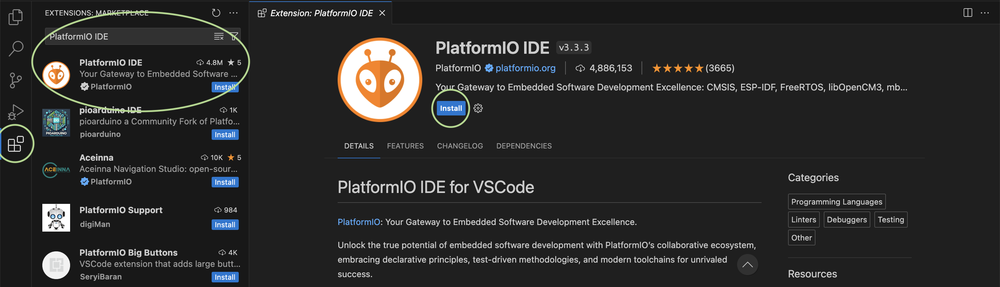
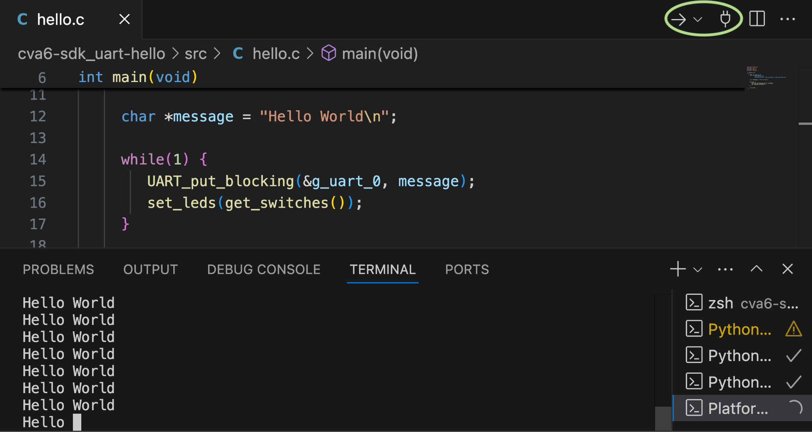
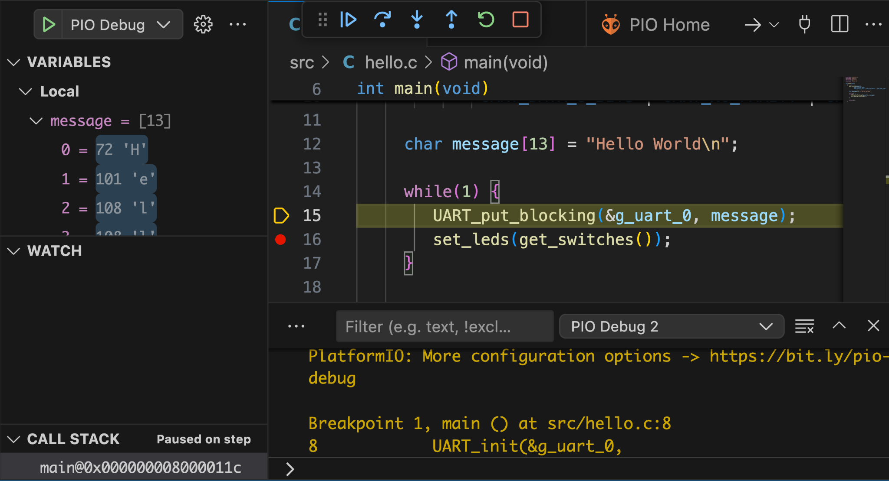

# PlatformIO support for CVA6 on the Genesys2 board

This guide describes how to install and use PlatformIO to interact with the CVA6 APU on the Genesys2 board.
This is suitable for bare-metal application development.
It removes the burden of managing a debugger and toolchain across different platforms, while also providing a convenient IDE and integrated debug.
We have tested on Ubuntu 20.04, macOS 15.1, and Windows 11 (though note some tricky driver installation on Windows).
The support is split into two components: a "platform" to describe the board configuration (based on [Shakti's platform](https://github.com/platformio/platform-shakti)), and a "framework" containing low-level driver support (based on [Thales' CVA6 baremetal BSP](https://github.com/ThalesGroup/cva6-baremetal-bsp)).

## Install

The install process is as follows (see below for more detail on each step):
1. Install VSCode
2. Install the PlatformIO extension
3. Install the CVA6 platform and framework

### Install VSCode

Downloads and instructions are available from the [Visual Studio Code website](https://code.visualstudio.com).

### Install PlatformIO

After opening VSCode, in the bar on the left, navigate to "Extensions".
Search for "PlatformIO IDE" select it, and click "Install".



More instructions can be found on the [PlatformIO website](https://platformio.org/platformio-ide).
As an alternative to the IDE install, the core PlatformIO components can be installed to allow command-line only use by following the instructions [here](https://docs.platformio.org/en/latest/core/installation/methods/).

### Install the CVA6 platform and framework

These are not yet distributed as PlatformIO packages, so need to be installed manually from the GitHub repositories.

For the platform:
```sh
git clone https://github.com/Capabilities-Limited/platform-cva6-genesys2
```
Then copy (or symlink) the repository into the "platforms" directory of your PlatformIO install:
```sh
mkdir -p ~/.platformio/platforms/
ln -s `pwd`/platform-cva6-genesys2 ~/.platformio/platforms/
```
TODO Windows

For the framework (note it contains a framework that needs updating):
```sh
git clone https://github.com/Capabilities-Limited/framework-cva6-genesys2
git -C framework-cva6-genesys2 submodule update --init --recursive
```
Then copy (or symlink) the repository into the "packages" directory of your PlatformIO install:
```sh
mkdir -p ~/.platformio/packages/
ln -s `pwd`/framework-cva6-genesys2 ~/.platformio/packages/
```

## Use

Once installed, the intended way to use PlatformIO is from the VSCode GUI.
However, command line alternatives are also available.

An [example project](https://github.com/Capabilities-Limited/platform-cva6-genesys2/tree/TODO) is included inside the platform repo.
This shows basic use of the UART and GPIO peripherals.

Open the project by opening the PlatformIO tab, click "Pick a folder" then navigate to the project (`~/.platformio/platforms/platform-cva6-genesys2/examples/cva6-sdk_uart_hello/`).

To just compile the project (i.e. not run the code), hit the "Build" button shown below (the button changes based on the last action performed, so you may need to hit the drop-down arrow instead).
To perform the equivalent from the command line, run `pio run` from the example project directory.


To upload the binary to the board (and automatically compile if not up to date), hit the drop-down arrow and select "Upload".
This assumes that the board is switched on, programmed with a CVA6 APU bitstream, and has the JTAG and UART USB cables connected.
From the command line: `pio run --target=upload`.
The serial monitor allows interaction with the UART: note you may need to switch serial device: this can be configured from the centre of the bar at the bottom of the PlatformIO window.



To run with debugging, insert a breakpoint by clicking next to a line number in a C file, then press "Run" from the menu bar, then "Start debugging".
After the program is uploaded to the board, this should allow single stepping and inspecting variable values from within the IDE.
The "Debug Console" tab shows more information.
Note: due to what seems to be a [PlatformIO bug](https://github.com/platformio/platformio-core/issues/5047), running with debugging may cause a Python error due to indexing a list out-of-bounds. Until this is fixed, you can just change [this file](https://github.com/platformio/platformio-core/blob/c1afb364e9039fac2838bd000227b0a1871a07a6/platformio/package/commands/exec.py#L57) (see the error message for the path on your system) as follows:
```diff
-  if args[0].endswith(".py"):
+  if args and args[0].endswith(".py"):
```


